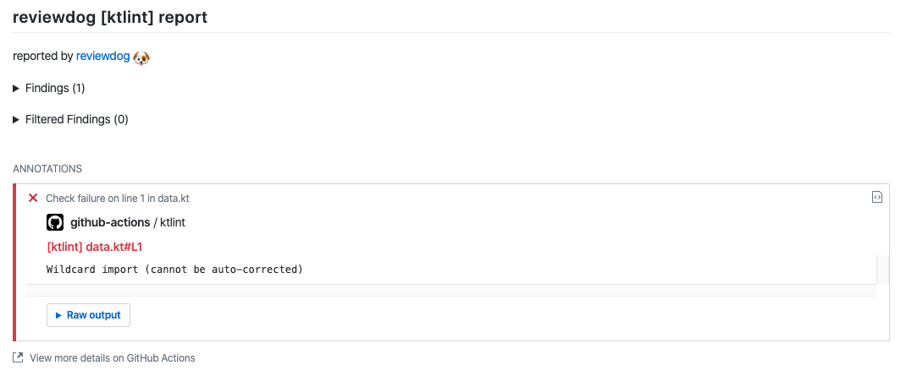
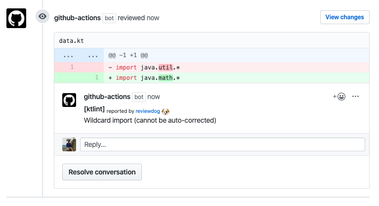

# GitHub Action: Run ktlint with reviewdog

TEST

This action runs [ktlint](https://ktlint.github.io/) with
[reviewdog](https://github.com/reviewdog/reviewdog) on pull requests
to enforce best practices.

## Examples

### With `github-pr-check`

By default, with `reporter: github-pr-check` an annotation is added to
the line:


### With `github-pr-review`

With `reporter: github-pr-review` a comment is added to
the Pull Request Conversation:


## Inputs

### `github_token`

**Required**. Must be in form of `github_token: ${{ secrets.github_token }}`.

### `level`

Optional. Report level for reviewdog [`info`,`warning`,`error`].
It's same as `-level` flag of reviewdog.
The default is `error`.

### `reporter`

Optional. Reporter of reviewdog command [`github-pr-check`,`github-pr-review`, `github-check`].
The default is `github-pr-check`.

See reviewdog reporters [documentation](https://github.com/reviewdog/reviewdog/tree/master#exit-codes) 
for more details on their functionality.

### `filter_mode`

Optional. Filtering for the reviewdog command [`added`,`diff_context`,`file`,`nofilter`].
The default is `added`.

See reviewdog filter mode [documentation](https://github.com/reviewdog/reviewdog/tree/master#filter-mode) for more details.

### `fail_on_error`

Optional. Exit code for reviewdog when errors are found [`true`,`false`] 
Default is false.

See reviewdog fail on error [documentation](https://github.com/reviewdog/reviewdog/tree/master#exit-codes) for more details.

### `relative`

Optional. Print files relative to the working directory [`true`/`false`]
The default value is true.

### `android`

Optional. Runs KtLint with [Android Kotlin Style Guide](https://android.github.io/kotlin-guides/style.html) [`true`/`false`]
The default value is false.

### `baseline`

Optional. Runs checks against the baseline file provided.

### `ktlint_version`

Optional. Defines the [ktlint](https://ktlint.github.io/) version to use.
The default value is `latest`.

## Example usage

```yml
name: reviewdog
on: [pull_request]
jobs:
  ktlint:
    name: Check Code Quality
    runs-on: ubuntu-latest

    steps:
      - name: Clone repo
        uses: actions/checkout@master
        with:
          fetch-depth: 1
      - name: ktlint
        uses: ScaCap/action-ktlint@master
        with:
          github_token: ${{ secrets.github_token }}
          reporter: github-pr-review # Change reporter
```
